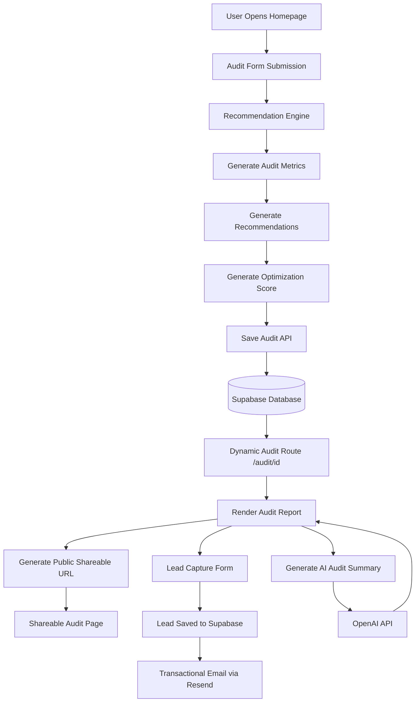

# Architecture

AI Cost Lens is a lightweight AI tooling audit platform designed to analyze subscription overlap, estimate optimization opportunities, and generate shareable audit reports for startups and engineering teams.

The system uses a server-rendered Next.js architecture combined with Supabase persistence, AI-generated summaries, and public shareable audit routes.

---

# System Architecture Diagram



---

# Data Flow

## 1. User submits audit information

The user enters:
- company information
- team size
- AI subscriptions
- monthly spend
- primary workflow usage

through the homepage audit form.

---

## 2. Recommendation engine processes input

The recommendation engine:
- calculates total monthly spend
- identifies overlapping subscriptions
- estimates monthly and annual savings
- generates optimization recommendations
- calculates an optimization score

This logic currently uses a lightweight rule-based evaluation system.

---

## 3. Audit persistence

The generated audit is stored in Supabase using the `/api/save-audit` endpoint.

Stored data includes:
- spend metrics
- recommendations
- optimization score
- AI summary
- per-tool breakdown

Sensitive lead information is intentionally excluded from public audit snapshots.

---

## 4. AI summary generation

The application generates a natural-language audit summary using the OpenAI API.

If the API fails or rate limits occur:
- a fallback summary generation system is used
- audit rendering still succeeds

This prevents report failures caused by external AI dependencies.

---

## 5. Dynamic audit rendering

Each audit receives a unique public URL:

```text
/audit/[id]
```

The page dynamically fetches audit data from Supabase and renders:
- metrics
- recommendations
- per-tool analysis
- optimization summary
- conditional CTA messaging

---

## 6. Lead capture flow

Users can optionally submit:
- email
- company name
- role
- team size

through the lead capture form.

Lead information is stored separately from public audit records for privacy and cleaner sharing architecture.

---

## 7. Transactional email workflow

After successful lead submission:
- the application triggers a transactional email using Resend
- users receive audit follow-up messaging
- messaging changes depending on optimization potential

---

# Why I Chose This Stack

## Next.js

Chosen because it provides:
- server rendering
- dynamic routing
- API routes
- strong TypeScript support
- simple Vercel deployment workflow

Next.js also made public audit page generation straightforward.

---

## TypeScript

Used for:
- safer data handling
- predictable audit structures
- easier refactoring
- stronger recommendation engine typing

---

## Supabase

Chosen because it provides:
- managed PostgreSQL
- REST APIs
- simple integration
- fast development velocity

It significantly reduced backend setup complexity.

---

## Tailwind CSS

Tailwind enabled:
- rapid UI iteration
- responsive layouts
- design consistency
- lightweight styling management

---

## OpenAI API

Used for:
- AI-generated audit summaries
- natural-language optimization explanations

This improves readability and product polish.

---

## Resend

Chosen for:
- simple transactional email integration
- developer-friendly API
- reliable email delivery

---

## Vercel

Used because:
- deployment is seamless with Next.js
- preview deployments are automatic
- environment variable management is straightforward
- GitHub integration is fast and reliable

---

# Scalability Considerations (10k Audits/Day)

The current implementation is optimized for rapid development and assignment delivery rather than large-scale production workloads.

If the platform needed to support 10k+ audits/day, I would introduce the following changes.

---

# 1. Queue-based summary generation

Currently:
- audit summaries are generated synchronously

Problem:
- external AI APIs become bottlenecks

Improvement:
- move AI summary generation into asynchronous background jobs using:
  - BullMQ
  - Redis
  - serverless queues

This would improve reliability and reduce request latency.

---

# 2. Recommendation engine service separation

Currently:
- recommendation logic runs directly inside the application

Improvement:
- isolate the recommendation engine into a dedicated service
- independently scale compute-heavy audit generation workloads

---

# 3. Database optimization

Currently:
- Supabase handles all reads and writes directly

Improvement:
- add:
  - indexing
  - caching
  - read replicas
  - query optimization

Frequently accessed public audits would be cached aggressively.

---

# 4. CDN optimization for public reports

Public shareable reports would be:
- statically cached
- edge-distributed
- revalidated periodically

This would significantly reduce database load.

---

# 5. Rate limiting and abuse prevention

At larger scale:
- stronger abuse prevention becomes necessary

I would add:
- IP-based throttling
- CAPTCHA protection
- request quotas
- audit generation limits

---

# 6. Authentication and organizations

For production SaaS usage:
- organization-level authentication
- audit history
- user dashboards
- role-based permissions

would become necessary.

---

# 7. Observability and monitoring

At scale, I would add:
- centralized logging
- tracing
- metrics dashboards
- uptime monitoring
- audit generation analytics

using tools such as:
- Sentry
- Grafana
- PostHog
- OpenTelemetry

---

# Current Repository Structure

```text
src/
 ├── app/
 ├── components/
 ├── data/
 ├── engine/
 ├── lib/
 ├── tests/
 └── types/
```

---