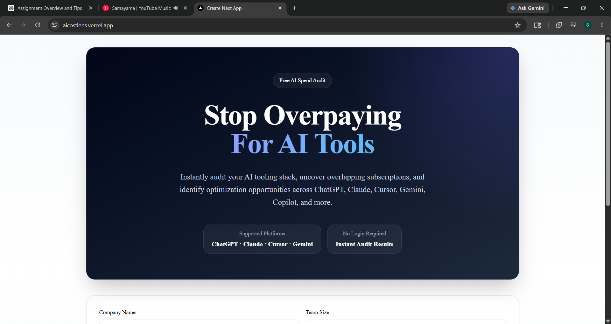
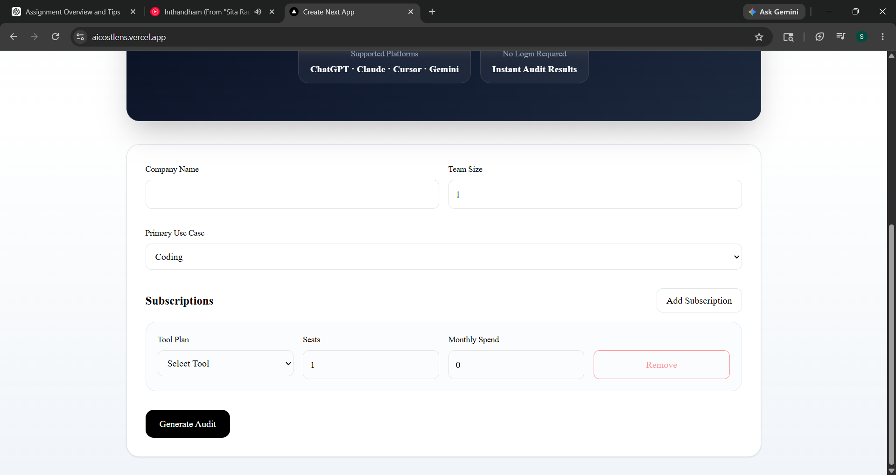
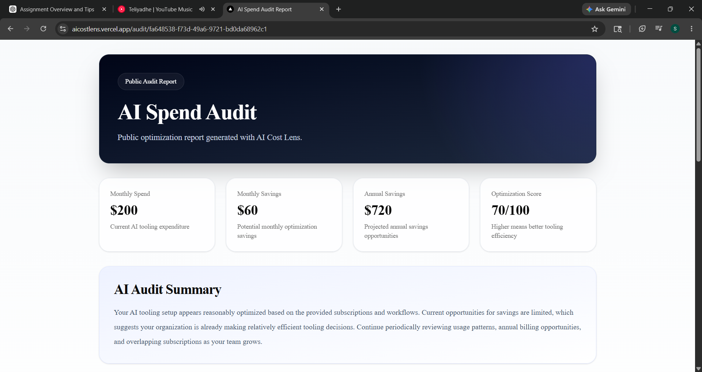
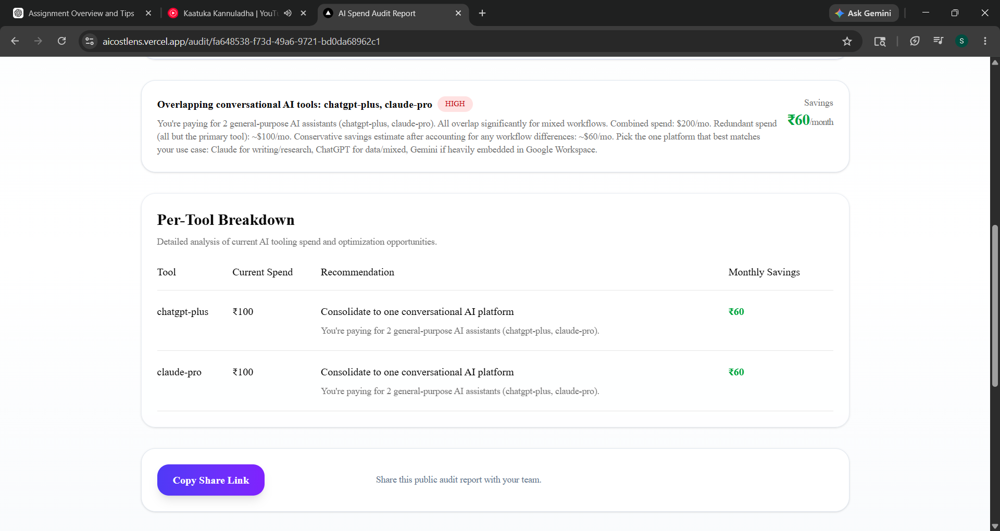
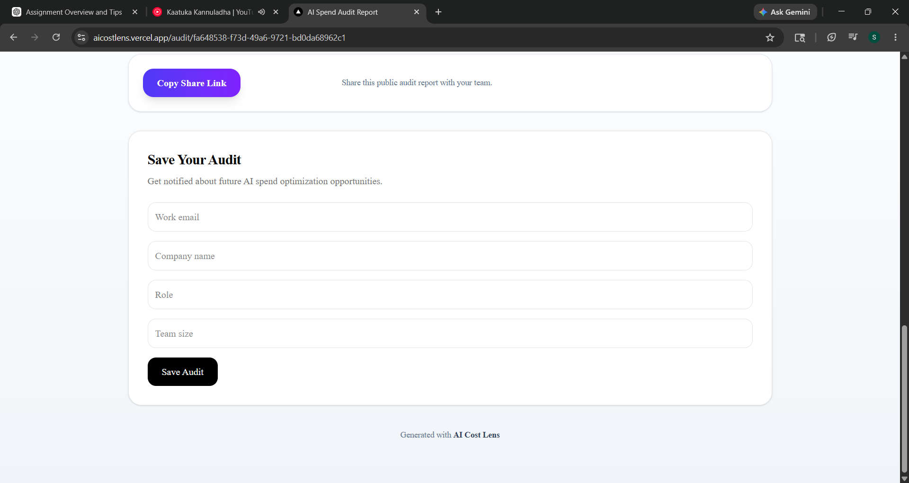
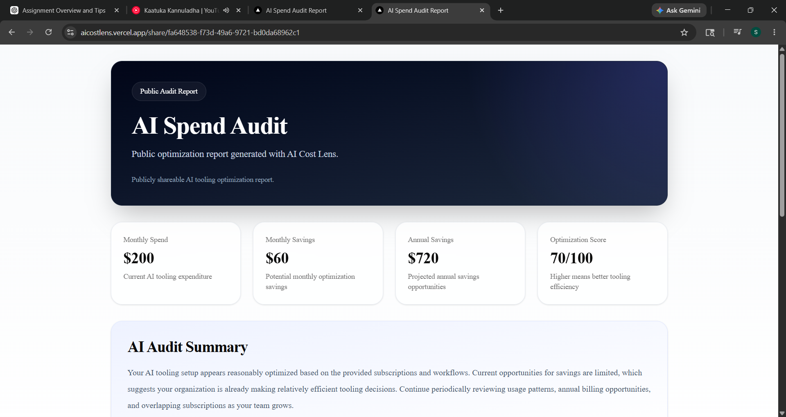
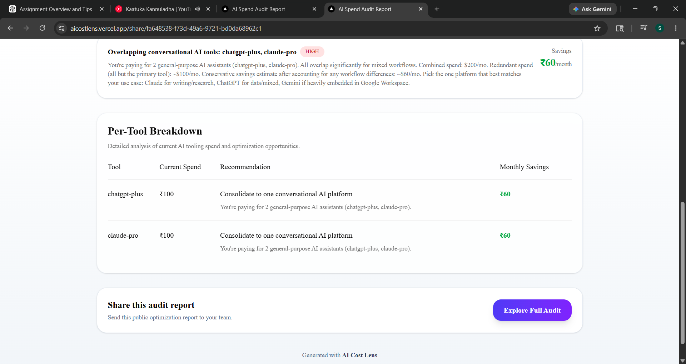
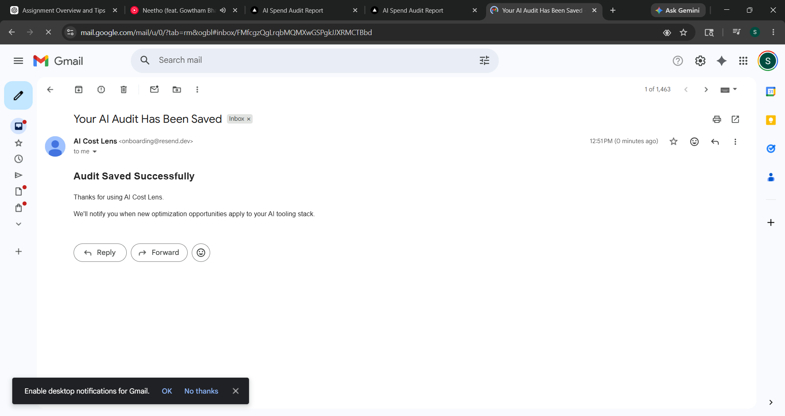

# AI Cost Lens

AI Cost Lens is an AI tooling audit platform that helps startups and teams identify overspending across AI subscriptions such as ChatGPT, Claude, Gemini, Cursor, Copilot, Windsurf, and Lovable. Users can generate optimization reports, discover overlapping tooling costs, and share public audit snapshots through dedicated URLs.

The platform is designed for startups, engineering teams, founders, and operations teams looking to improve AI tooling efficiency, reduce unnecessary SaaS spend, and monitor optimization opportunities as their AI stack evolves.

---

# Live Demo

Deployment URL:  
https://aicostlens.vercel.app/

---

# Screenshots

## Homepage

### Hero Section



### Audit Form



---

## Generated Audit Report

### Top Section



### Middle Section



### Bottom Section



---

## Shareable Public Audit Page

### Shareable Audit Top



### Shareable Audit Bottom



---

## Transactional Email



---

# Features

- AI tooling spend audit generation
- Optimization recommendation engine
- AI-generated audit summaries
- Per-tool spend breakdown analysis
- Public shareable audit reports
- Lead capture workflow
- Open Graph metadata support
- Twitter preview support
- Conditional high-savings CTA logic
- GitHub Actions CI workflow
- Automated recommendation engine tests with Vitest
- Responsive UI with Tailwind CSS
- Dynamic audit routing using Next.js

---

# Pricing Data Verification

All pricing data used in the recommendation engine and audit calculations was verified against official vendor pricing pages as of **2026-05-06**.

Detailed pricing references and source URLs are documented in:

```text
PRICING_DATA.md
```

---

# Tech Stack

- Next.js 15
- TypeScript
- Tailwind CSS
- Supabase
- OpenAI API
- Resend
- Vitest
- Vercel
- GitHub Actions

---

# Quick Start

## 1. Clone the repository

```bash
git clone https://github.com/Sneha-Deepthi/ai-cost-lens.git
cd ai-cost-lens
```

---

## 2. Install dependencies

```bash
npm install
```

---

## 3. Configure environment variables

Create a `.env.local` file in the project root:

```env
NEXT_PUBLIC_SUPABASE_URL=
NEXT_PUBLIC_SUPABASE_ANON_KEY=

OPENAI_API_KEY=

RESEND_API_KEY=

NEXT_PUBLIC_BASE_URL=http://localhost:3000
```

### Environment variable descriptions

| Variable | Purpose |
|---|---|
| `NEXT_PUBLIC_SUPABASE_URL` | Supabase project URL |
| `NEXT_PUBLIC_SUPABASE_ANON_KEY` | Supabase public anonymous key |
| `OPENAI_API_KEY` | Used for AI-generated audit summaries |
| `RESEND_API_KEY` | Used for transactional audit emails |
| `NEXT_PUBLIC_BASE_URL` | Base application URL used for metadata and public sharing links |

---

## 4. Run locally

```bash
npm run dev
```

Open:

```text
http://localhost:3000
```

---

## 5. Run Tests

```bash
npm run test
```

Run tests in watch mode:

```bash
npx vitest --watch
```

---

# Deployment

The project is deployed using Vercel.

## Production deployment

```bash
git push origin main
```

Vercel automatically builds and deploys the latest changes from the main branch.

---

# Decisions & Trade-offs

## 1. Public audit snapshots instead of authenticated dashboards

I chose public shareable audit URLs to optimize for viral sharing and recruiter review simplicity. This reduced implementation complexity compared to a full authenticated SaaS dashboard system.

---

## 2. Lightweight recommendation engine instead of real billing integrations

The recommendation logic is currently rule-based and mock-data driven rather than integrating directly with provider billing APIs. This allowed faster iteration while still demonstrating optimization reasoning clearly.

---

## 3. Server-side generated public pages

Audit pages are rendered server-side using dynamic routing and Supabase persistence. This improves shareability, SEO behavior, and Open Graph preview support.

---

## 4. Separate lead storage from public audit data

Public reports intentionally exclude identifying information such as email addresses and company names. Lead capture data is stored independently for better privacy and cleaner sharing architecture.

---

## 5. Fallback summary generation strategy

The application uses AI-generated summaries with fallback summary handling to ensure audit reports still render even if external AI requests fail or rate limits occur.

---

# Project Structure

```text
src/
 ├── app/
 ├── components/
 ├── data/
 ├── engine/
 ├── lib/
 ├── tests/
 └── types/
```

---

# CI/CD

GitHub Actions workflow automatically validates builds on push.

Vercel handles automatic production deployments from the `main` branch.

---

# Future Improvements

- Real billing provider integrations
- Historical audit tracking
- Team authentication and dashboards
- Exportable PDF audit reports
- Multi-tenant organization support
- Advanced recommendation scoring
- AI-powered pricing intelligence

---

# Author

Sneha Deepthi

GitHub:  
https://github.com/Sneha-Deepthi

---